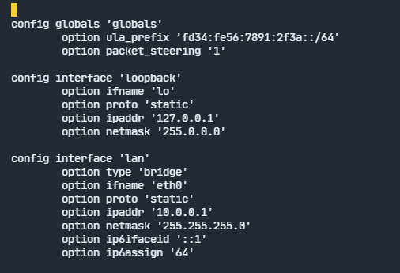
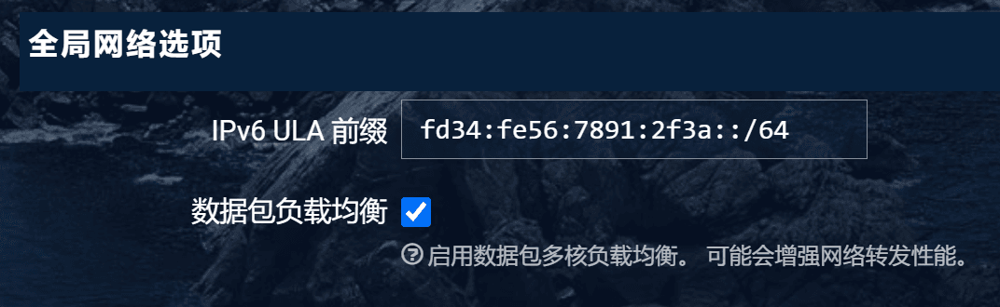
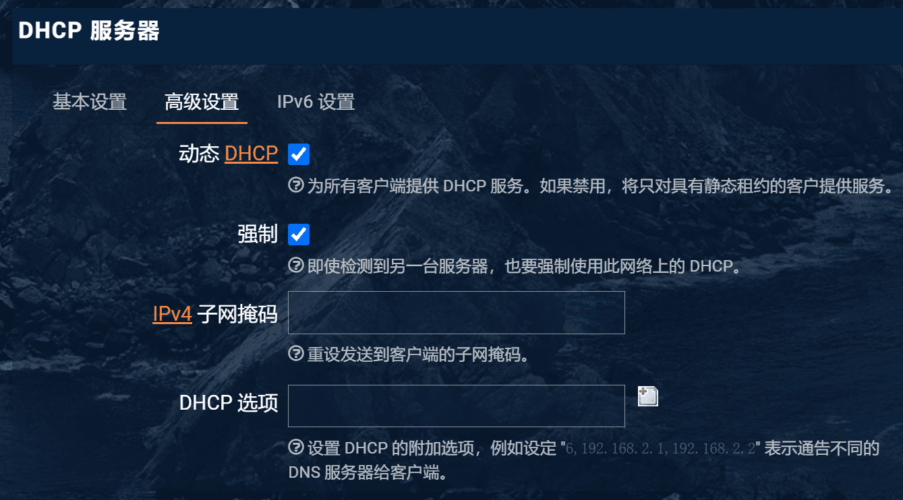
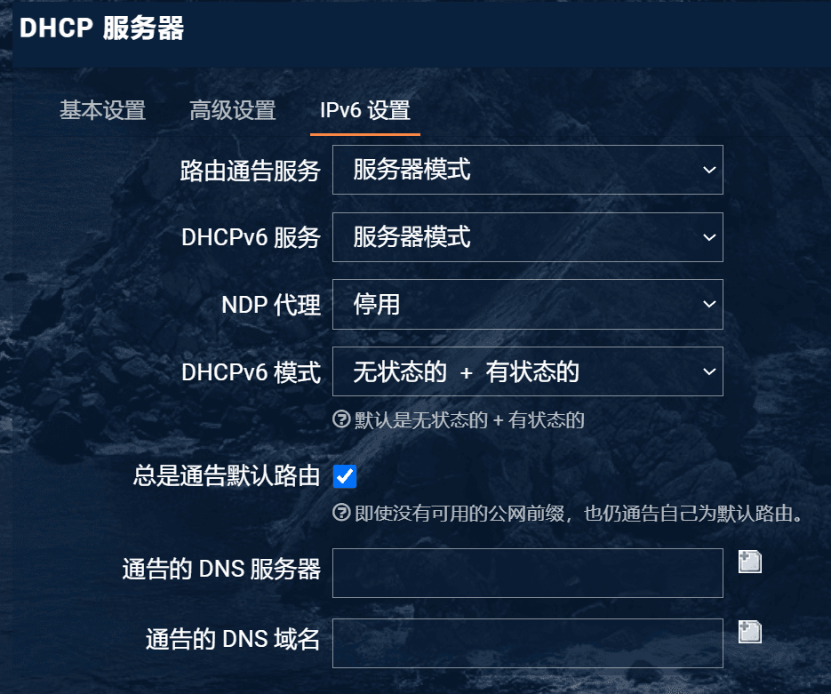
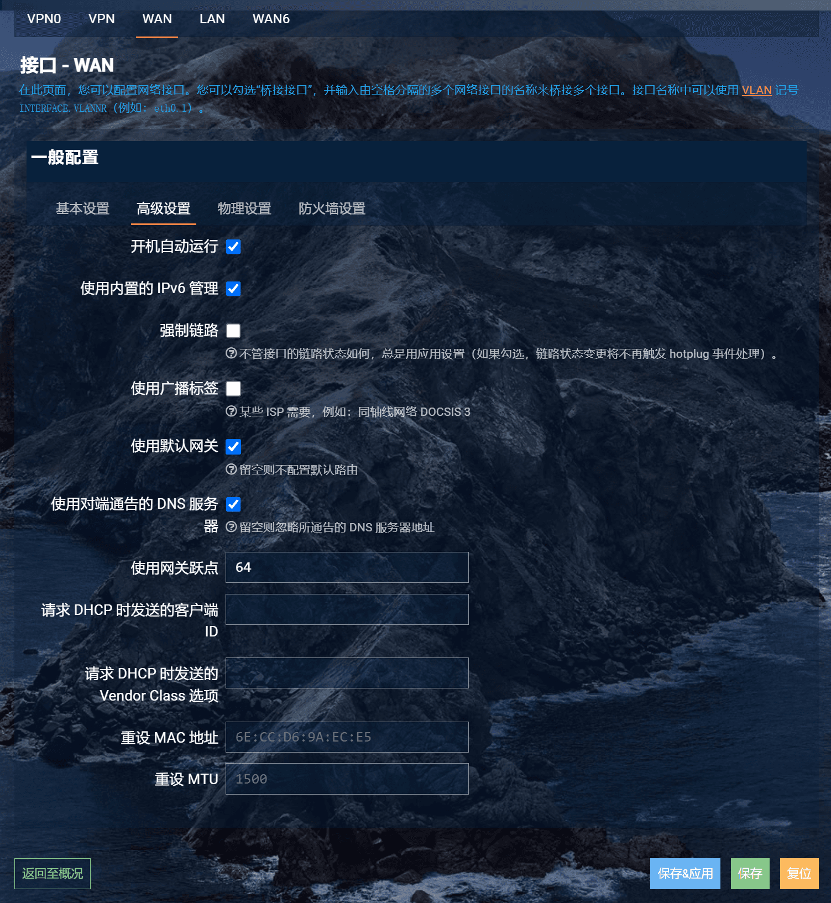
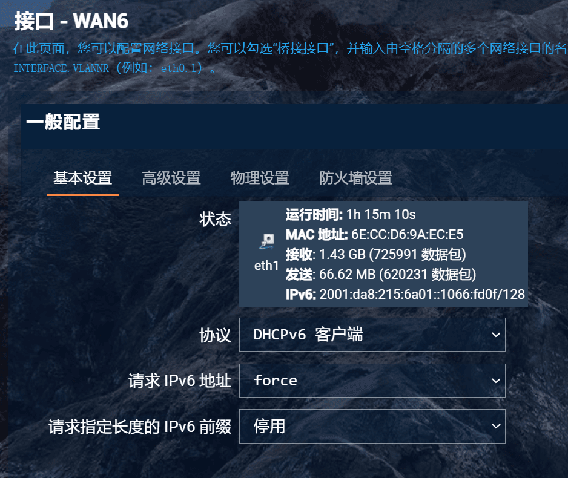
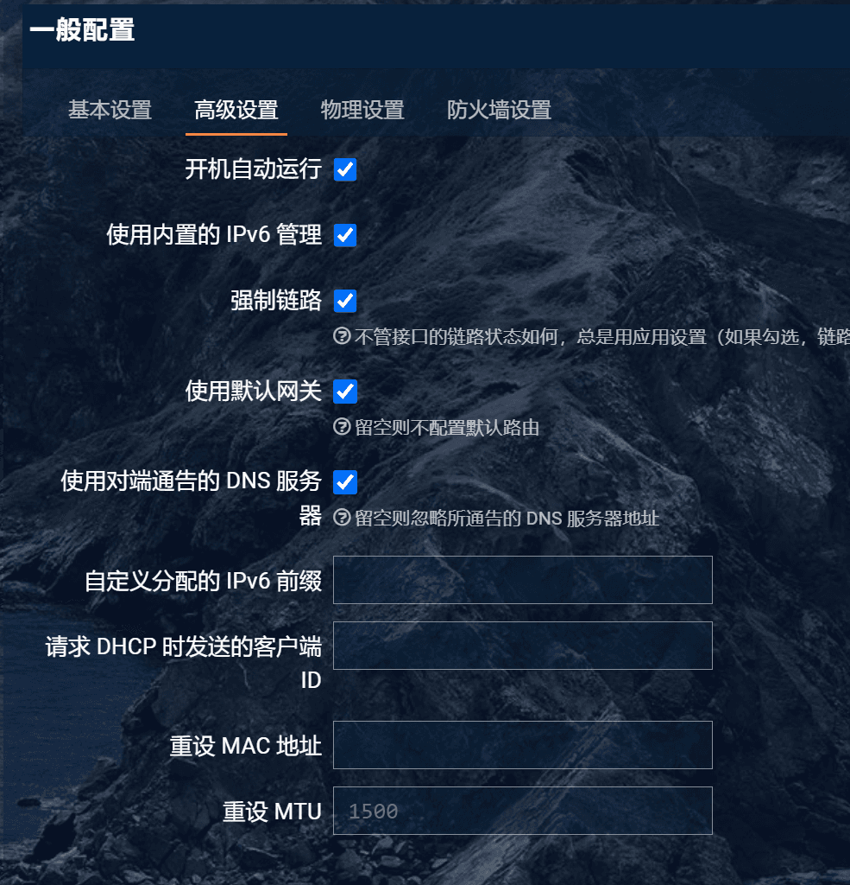
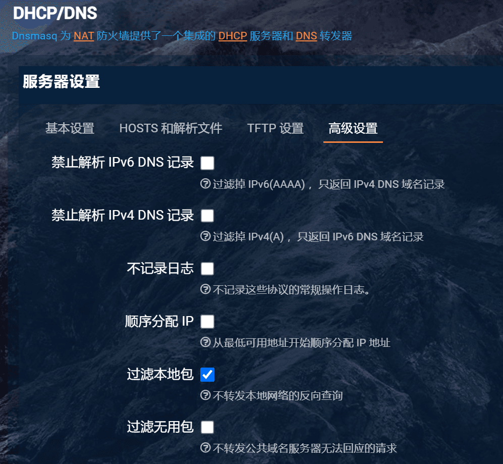
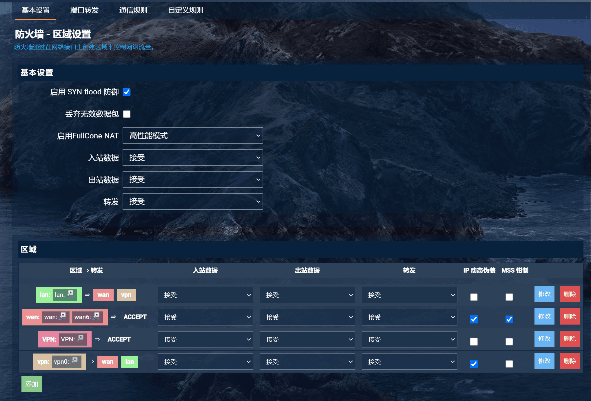
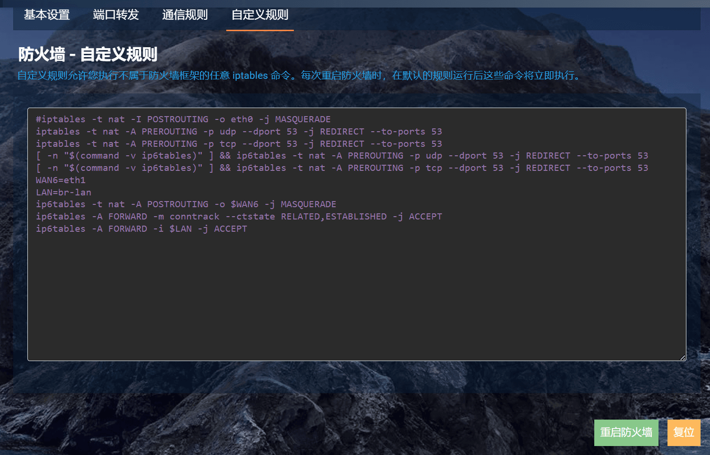

# 前言

首先介绍一下我的网络环境：

- 设备：一台双网口 (eth0, eth1) 主板的服务器运行 OpenWrt 虚拟机（称为设备 AIO）、一台红米 AX6S 无线路由器刷 OpenWrt（称为设备 AP）、一台台式机、若干移动设备、三条网线。
- 拓扑：墙壁有线校园网接口 <-> AIO 的 eth1，AIO 的 eth0 <-> AP 的 LAN 口。

BUPT 校园网默认分配的 v6 地址是 128 位前缀的，子网大小为 1，只能一台设备使用，所以需要 NAT6（方案之一，也许可以用 Relay Mode，但是我没尝试成功）。

# 配置 NAT6

该部分参考了 [校内 IPv6 设置教程 | 南科手册](https://sustech.online/service/network/ipv6/) 和 [OpenWRT 路由器作为 IPv6 网关的配置](https://github.com/tuna/ipv6.tsinghua.edu.cn/blob/master/openwrt.md)

## 更改全局网络选项 IPv6 ULA 前缀

点击“网络 Network- 接口 Interfaces”。如果你的界面没有“全局网络选项 Global Network Options”，在`/etc/config/network` 里加入 `config globals 'globals'`，刷新页面即可（若仍没有，尝试删除 LuCI 缓存并重启 LuCI 服务）。



在全局网络选项中更改 ULA 前缀，例如 `fd34:fe56:7891:2f3a::/64`，可以使用 [ULA 生成器](https://www.unique-local-ipv6.com/)
> IPv6 提供一段称为 Unique Local Address（ULA）的地址段 fc00::/7，包含 fc00::/8 和 fd00::/8 两部分：目前 fc00::/8 的使用还没有定义，我们不去管它；fd00::/8 可以被自由使用。fd00::/8 是一个十分巨大的地址段，你可以从中挑选一个/48 的子段分配给你的局域网。RFC 4193 建议使用随机生成的方法，使每个局域网的地址段都不同（这也是 ULA 名字的由来），从而避免局域网合并时地址冲突的麻烦。当然这主要是针对企业而讲的，家庭使用的话随机生成还是挑个好记的自己斟酌。如果要随机生成，Google 一下 ULA generator 有真相。
> ——摘自 [V2EX](https://www.v2ex.com/t/488116)



## 更改 LAN 接口选项

LAN 接口 DHCP 服务器中，打开“动态 DHCP”和“强制”。



LAN 接口 IPv6 设置，“路由器通告服务”和“DHCPv6 服务”修改为“服务器模式”，“NDP 代理”设置为“禁用”，“DHCPv6”选择“无状态的 + 有状态的”，并勾选“总是通告默认路由”。记得点击“保存&应用”。



## 更改 WAN/WAN6 接口选项

WAN 口设置 - 高级设置中，勾选上“使用内置的 IPv6 管理”。



WAN6 口设置 - 基本设置中，将“协议”修改为“DHCPv6 客户端”，“请求 IPv6 地址”为“force”，“请求指定长度的 IPv6 前缀”为“停用（已禁用）”。



WAN6 口设置 - 高级设置中，勾选“使用内置的 IPv6 管理”，“强制链路”和“使用默认网关”。



## 更改 DHCP/DNS 设置

网络 -DHCP/DNS- 高级设置，取消勾选“禁止解析 IPv6 DNS 记录”。



## 更改防火墙设置

“基本设置”中，“转发”改为“接受”。

“区域”设置中，wan 区域均改为“接受”。



防火墙自定义规则，加入以下几行：

```
WAN6=eth1
LAN=br-lan
ip6tables -t nat -A POSTROUTING -o $WAN6 -j MASQUERADE
ip6tables -A FORWARD -m conntrack --ctstate RELATED,ESTABLISHED -j ACCEPT
ip6tables -A FORWARD -i $LAN -j ACCEPT
```

其中 `eth1` 和 `br-lan` 对应“网络 - 接口”界面中 WAN 和 LAN 的设备名。



# 测试 IPv6

“网络 - 网络诊断”，选择 IPv6，点击 Ping，成功访问（或者在 shell 中 `ping -6 openwrt.org`）。

# 自动配置流量转发路由表

使用 SSH 或“系统 -TTYD 终端”连接 Shell，输入用户名 root 和密码登录。

终端中输入 `vi /etc/hotplug.d/iface/99-ipv6` 新建文件，输入如下内容：

```shell
#!/bin/sh
[ "$ACTION" = ifup ] || exit 0
iface=wan6
[ -z "$iface" -o "$INTERFACE" = "$iface" ] || exit 0
ip -6 route add `ip -6 route show default|sed -e 's/from [^ ]* //'`
logger -t IPv6 "Add IPv6 default route."
```

注意 `iface=wan6` 这行，`wan6` 需要替换成“网络 - 接口”里看到的 DHCPv6 客户端对应接口名字。

最后，`chmod +x /etc/hotplug.d/iface/99-ipv6` 并重启主路由，此时连接到主路由的设备（不包括接入点路由）即可获取到 IPv6 地址。

---

完
