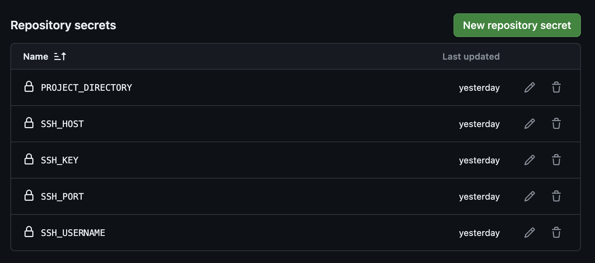
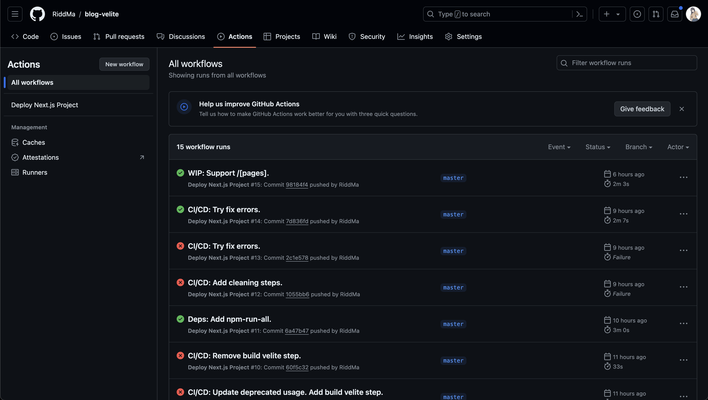
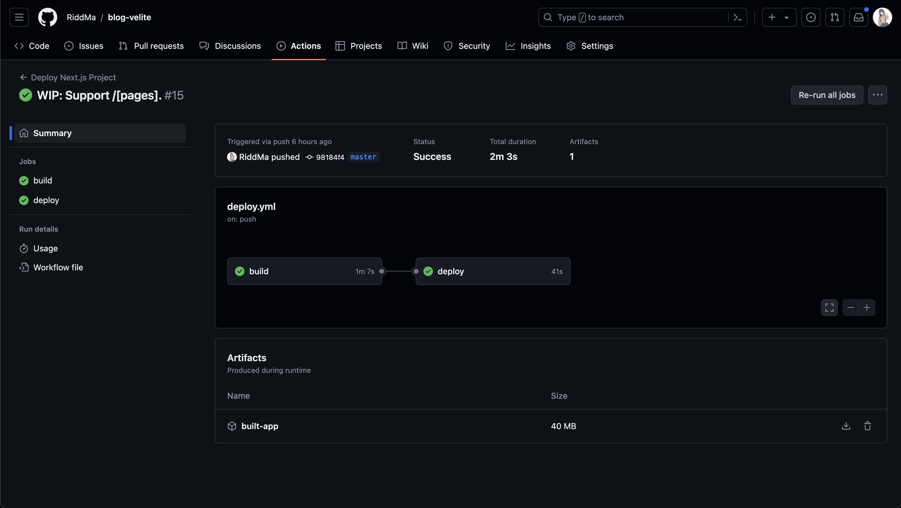
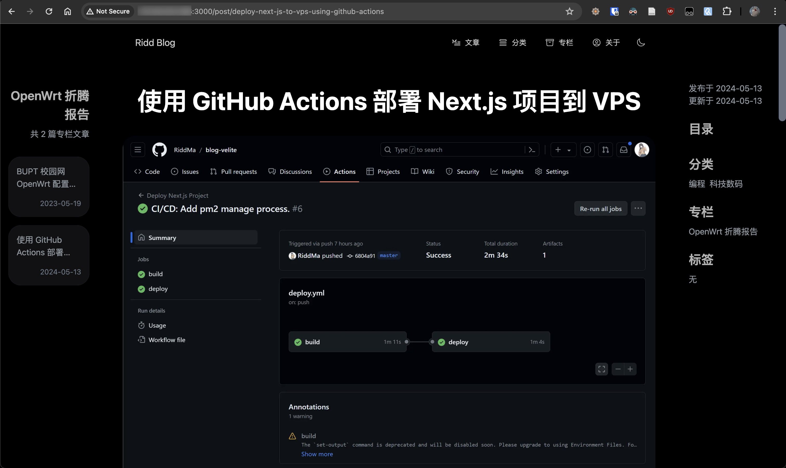

## 流程

### 配置服务器

首先需要配置 SSH 允许 GitHub Actions 通过 SSH 连接到你的服务器：
1. 为 GitHub Actions 配置一个系统用户。
2. 生成 SSH 密钥，将公钥添加到服务器的`~/.ssh/authorized_keys`文件。
3. 添加私钥到 GitHub 仓库。

添加用户：

```bash
sudo adduser github
sudo usermod -aG sudo github # 授予 sudo 权限，可选
```

生成 SSH 密钥：

```bash
ssh-keygen -t rsa -b 4096 -C "github-actions-node"
ssh-copy-id -i ~/.ssh/keyname.pub username@remote_host # 假设生成的公钥文件是 keyname.pub。Windows 系统没有 ssh-copy-id，需要手动添加。
```

添加私钥到 GitHub 仓库：

使用 `pbcopy < ~/.ssh/github_actions_node` 将私钥复制到剪切板（也可手动复制）。

访问 `<你的仓库 URL>/settings/secrets/actions` （Settings -> Secrets and Variables -> Actions），点击 `New repository secret` 添加新的 secret，名称 `SSH_KEY`（与下面 yaml 文件中对应），内容为私钥内容。

设置 GitHub Actions Workflow：

1. 配置仓库 Secrets。
2. 在 GitHub 仓库根目录下创建一个新的`.github/workflows`目录。
3. 在这个目录中创建一个 YAML 文件（如 `deploy.yml`），并定义 CI/CD 流程。

配置 Secrets：

访问 `<你的仓库 URL>/settings/secrets/actions` （Settings -> Secrets and Variables -> Actions），点击 `New repository secret` 新增。共需添加以下几个 secret：

- `PROJECT_DIRECTORY`: 项目部署路径，可以是相对或绝对路径。相对路径相对于登录用户的`~`路径，绝对路径注意是否有权限。
- `SSH_KEY`：SSH 私钥。[前文](#添加私钥到 GitHub 仓库)已添加。
- `SSH_HOST`：SSH 登录服务器的 IP 地址或域名。
- `SSH_USERNAME`：SSH 登录用户名。
- `SSH_PORT`：SSH 端口，默认为 22。



创建 CI/CD 流程：

在 GitHub 仓库根目录创建一个 `.github/workflows/deploy.yml` 如下：

```yaml
name: Deploy Next.js Project

on:
  push:
    branches:
      - master

jobs:
  build:
    runs-on: ubuntu-latest
    outputs:
      cache-key: ${{ steps.cache-key.outputs.key }}
    steps:
      - name: Checkout Repository
        uses: actions/checkout@v4

      - name: Setup Node.js
        uses: actions/setup-node@v4
        with:
          node-version: '18'
          cache: 'npm'

      - name: Install Dependencies
        run: npm install

      - name: Build Project
        env:
          DATABASE_URL: ${{ secrets.DATABASE_URL }}
          API_KEY: ${{ secrets.API_KEY }}
        run: |
          npx prisma migrate dev --name init
          npm run build

      - name: Generate Cache Key
        id: cache-key
        run: echo "cache_key=$(date +%s)" >> $GITHUB_OUTPUT

      - name: Archive Artifacts
        uses: actions/upload-artifact@v4
        with:
          name: built-app
          path: |
            .next
            .velite
            public
            package.json
            prisma
            node_modules/.prisma
            next.config.mjs

  deploy:
    needs: build
    runs-on: ubuntu-latest
    timeout-minutes: 30
    steps:
      - name: Download Artifacts
        uses: actions/download-artifact@v4
        with:
          name: built-app

      - name: Clean Previous Build
        uses: appleboy/ssh-action@master
        with:
          host: ${{ secrets.SSH_HOST }}
          username: ${{ secrets.SSH_USERNAME }}
          key: ${{ secrets.SSH_KEY }}
          port: ${{ secrets.SSH_PORT }}
          script: |
            cd ${{ secrets.PROJECT_DIRECTORY }}
            rm -rf .next .velite public package.json prisma/migrations prisma/schema.prisma node_modules/.prisma next.config.mjs
            find prisma -type f ! -name 'prod.db' -delete

      - name: Deploy to Server
        uses: appleboy/scp-action@master
        with:
          host: ${{ secrets.SSH_HOST }}
          username: ${{ secrets.SSH_USERNAME }}
          key: ${{ secrets.SSH_KEY }}
          port: ${{ secrets.SSH_PORT }}
          source: ".next, .velite, public, package.json, prisma/migrations, prisma/schema.prisma, node_modules/.prisma, next.config.mjs"
          target: ${{ secrets.PROJECT_DIRECTORY }}

      - name: Install Dependencies on Server
        uses: appleboy/ssh-action@master
        with:
          host: ${{ secrets.SSH_HOST }}
          username: ${{ secrets.SSH_USERNAME }}
          key: ${{ secrets.SSH_KEY }}
          port: ${{ secrets.SSH_PORT }}
          script: |
            cd ${{ secrets.PROJECT_DIRECTORY }}
            export NVM_DIR=~/.nvm
            source ~/.nvm/nvm.sh
            NODE_OPTIONS="--max-old-space-size=1536" yarn install
            NODE_OPTIONS="--max-old-space-size=1536" yarn add sharp --ignore-engines

      - name: Run Prisma Migrations on Server
        uses: appleboy/ssh-action@master
        env:
          DATABASE_URL: ${{ secrets.DATABASE_URL }}
          API_KEY: ${{ secrets.API_KEY }}
        with:
          host: ${{ secrets.SSH_HOST }}
          username: ${{ secrets.SSH_USERNAME }}
          key: ${{ secrets.SSH_KEY }}
          port: ${{ secrets.SSH_PORT }}
          envs: DATABASE_URL,API_KEY
          script: |
            cd ${{ secrets.PROJECT_DIRECTORY }}
            export NVM_DIR=~/.nvm 
            source ~/.nvm/nvm.sh
            npx prisma migrate deploy

      - name: Restart Server
        uses: appleboy/ssh-action@master
        env:
          DATABASE_URL: ${{ secrets.DATABASE_URL }}
          API_KEY: ${{ secrets.API_KEY }}
        with:
          host: ${{ secrets.SSH_HOST }}
          username: ${{ secrets.SSH_USERNAME }}
          key: ${{ secrets.SSH_KEY }}
          port: ${{ secrets.SSH_PORT }}
          envs: DATABASE_URL,API_KEY
          script: |
            cd ${{ secrets.PROJECT_DIRECTORY }}
            export NVM_DIR=~/.nvm
            source ~/.nvm/nvm.sh
            pm2 list | grep "blog-velite" && pm2 restart "blog-velite" || pm2 start yarn --name "blog-velite" -- start
            pm2 save
```

在`Restart Server`这一步骤中，使用了 yarn 作为部署 VPS 的包管理器。这是因为 yarn 消耗系统资源更少，适合弱鸡 VPS。

`NODE_OPTIONS="--max-old-space-size=1536"` 增加默认内存限制，否则可能出现类似  `FATAL ERROR: Reached heap limit Allocation failed - JavaScript heap out of memory` 的 OOM 报错。

:::gpt{model="GPT-4o"}
这个 GitHub Actions 配置文件是用于自动化部署 Next.js 项目的流程。具体配置的解释如下：

这个配置文件是一个 GitHub Actions 工作流，旨在自动化部署一个 Next.js 项目到服务器。以下是对每个部分的详细解释：

### 文件结构

```yaml
name: Deploy Next.js Project
```
- `name`: 定义工作流的名称，这里是 "Deploy Next.js Project"。

### 触发条件

```yaml
on:
  push:
    branches:
      - master
```
- `on`: 指定工作流的触发条件。这里是当代码被推送到 `master` 分支时触发。

### 工作任务

#### 构建任务

```yaml
jobs:
  build:
    runs-on: ubuntu-latest
    outputs:
      cache-key: ${{ steps.cache-key.outputs.key }}
    steps:
```
- `jobs`: 定义工作流中的任务。
- `build`: 定义构建任务。
- `runs-on`: 指定运行环境，这里是 `ubuntu-latest`。
- `outputs`: 定义输出变量，这里是 `cache-key`。

##### 步骤1：检出代码

```yaml
      - name: Checkout Repository
        uses: actions/checkout@v4
```
- `actions/checkout@v4`: 使用 GitHub 官方动作来检出代码库。

##### 步骤2：设置 Node.js 环境

```yaml
      - name: Setup Node.js
        uses: actions/setup-node@v4
        with:
          node-version: '18'
          cache: 'npm'
```
- `actions/setup-node@v4`: 设置 Node.js 环境，指定使用版本 `18`，并启用 npm 缓存。

##### 步骤3：安装依赖

```yaml
      - name: Install Dependencies
        run: npm install
```
- `npm install`: 安装项目依赖。

##### 步骤4：构建项目

```yaml
      - name: Build Project
        env:
          DATABASE_URL: ${{ secrets.DATABASE_URL }}
          API_KEY: ${{ secrets.API_KEY }}
        run: |
          npx prisma migrate dev --name init
          npm run build
```
- `env`: 设置环境变量，包括 `DATABASE_URL` 和 `API_KEY`。
- `npx prisma migrate dev --name init`: 运行 Prisma 迁移。
- `npm run build`: 构建项目。

##### 步骤5：生成缓存键

```yaml
      - name: Generate Cache Key
        id: cache-key
        run: echo "cache_key=$(date +%s)" >> $GITHUB_OUTPUT
```
- 生成一个基于当前时间的缓存键并输出。

##### 步骤6：存档构建产物

```yaml
      - name: Archive Artifacts
        uses: actions/upload-artifact@v4
        with:
          name: built-app
          path: |
            .next
            .velite
            public
            package.json
            prisma
            node_modules/.prisma
            next.config.mjs
```
- `actions/upload-artifact@v4`: 上传构建产物作为工件。

#### 部署任务

```yaml
  deploy:
    needs: build
    runs-on: ubuntu-latest
    timeout-minutes: 30
    steps:
```
- `deploy`: 定义部署任务。
- `needs: build`: 表示此任务依赖于 `build` 任务的完成。
- `timeout-minutes`: 设置任务超时时间为 30 分钟。

##### 步骤1：下载构建产物

```yaml
      - name: Download Artifacts
        uses: actions/download-artifact@v4
        with:
          name: built-app
```
- `actions/download-artifact@v4`: 下载之前上传的构建产物。

##### 步骤2：清理之前的构建

```yaml
      - name: Clean Previous Build
        uses: appleboy/ssh-action@master
        with:
          host: ${{ secrets.SSH_HOST }}
          username: ${{ secrets.SSH_USERNAME }}
          key: ${{ secrets.SSH_KEY }}
          port: ${{ secrets.SSH_PORT }}
          script: |
            cd ${{ secrets.PROJECT_DIRECTORY }}
            rm -rf .next .velite public package.json prisma/migrations prisma/schema.prisma node_modules/.prisma next.config.mjs
            find prisma -type f ! -name 'prod.db' -delete
```
- 使用 `appleboy/ssh-action@master` 通过 SSH 连接到服务器并清理之前的构建文件。

##### 步骤3：部署到服务器

```yaml
      - name: Deploy to Server
        uses: appleboy/scp-action@master
        with:
          host: ${{ secrets.SSH_HOST }}
          username: ${{ secrets.SSH_USERNAME }}
          key: ${{ secrets.SSH_KEY }}
          port: ${{ secrets.SSH_PORT }}
          source: ".next, .velite, public, package.json, prisma/migrations, prisma/schema.prisma, node_modules/.prisma, next.config.mjs"
          target: ${{ secrets.PROJECT_DIRECTORY }}
```
- 使用 `appleboy/scp-action@master` 通过 SCP 将新的构建文件上传到服务器。

##### 步骤4：在服务器上安装依赖

```yaml
      - name: Install Dependencies on Server
        uses: appleboy/ssh-action@master
        with:
          host: ${{ secrets.SSH_HOST }}
          username: ${{ secrets.SSH_USERNAME }}
          key: ${{ secrets.SSH_KEY }}
          port: ${{ secrets.SSH_PORT }}
          script: |
            cd ${{ secrets.PROJECT_DIRECTORY }}
            export NVM_DIR=~/.nvm
            source ~/.nvm/nvm.sh
            NODE_OPTIONS="--max-old-space-size=1536" yarn install
            NODE_OPTIONS="--max-old-space-size=1536" yarn add sharp --ignore-engines
```
- 在服务器上安装项目依赖，并添加 `sharp` 依赖。

##### 步骤5：在服务器上运行 Prisma 迁移

```yaml
      - name: Run Prisma Migrations on Server
        uses: appleboy/ssh-action@master
        env:
          DATABASE_URL: ${{ secrets.DATABASE_URL }}
          API_KEY: ${{ secrets.API_KEY }}
        with:
          host: ${{ secrets.SSH_HOST }}
          username: ${{ secrets.SSH_USERNAME }}
          key: ${{ secrets.SSH_KEY }}
          port: ${{ secrets.SSH_PORT }}
          envs: DATABASE_URL,API_KEY
          script: |
            cd ${{ secrets.PROJECT_DIRECTORY }}
            export NVM_DIR=~/.nvm 
            source ~/.nvm/nvm.sh
            npx prisma migrate deploy
```
- 运行 Prisma 的数据库迁移。

##### 步骤6：重启服务器上的应用

```yaml
      - name: Restart Server
        uses: appleboy/ssh-action@master
        env:
          DATABASE_URL: ${{ secrets.DATABASE_URL }}
          API_KEY: ${{ secrets.API_KEY }}
        with:
          host: ${{ secrets.SSH_HOST }}
          username: ${{ secrets.SSH_USERNAME }}
          key: ${{ secrets.SSH_KEY }}
          port: ${{ secrets.SSH_PORT }}
          envs: DATABASE_URL,API_KEY
          script: |
            cd ${{ secrets.PROJECT_DIRECTORY }}
            export NVM_DIR=~/.nvm
            source ~/.nvm/nvm.sh
            pm2 list | grep "blog-velite" && pm2 restart "blog-velite" || pm2 start yarn --name "blog-velite" -- start
            pm2 save
```
- 使用 `pm2` 进程管理器重启或启动应用。

这个配置文件涵盖了从代码检出、环境设置、依赖安装、项目构建、上传构建产物、清理旧构建、部署新构建、安装服务器依赖、运行数据库迁移到重启应用的完整流程。这确保了项目在每次代码推送到 `master` 分支时都能自动完成构建和部署。
:::

### 配置 VPS 服务器

在首次触发 Actions 部署之前，先安装好依赖：

```bash
cd /path/to/deployment # 与 secrets.PROJECT_DIRECTORY 相同
# 使用 pm2 管理应用
yarn global add pm2
```

随后向仓库提交更改，检查 Actions 是否运行。

## 效果





配置文件使用 `yarn start` 即`next start`，默认运行在 3000 端口：


