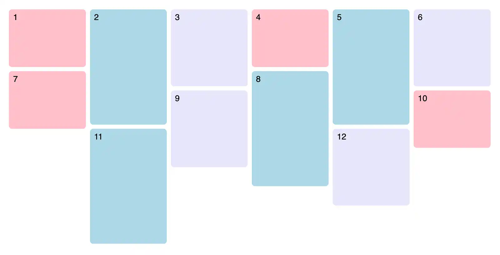
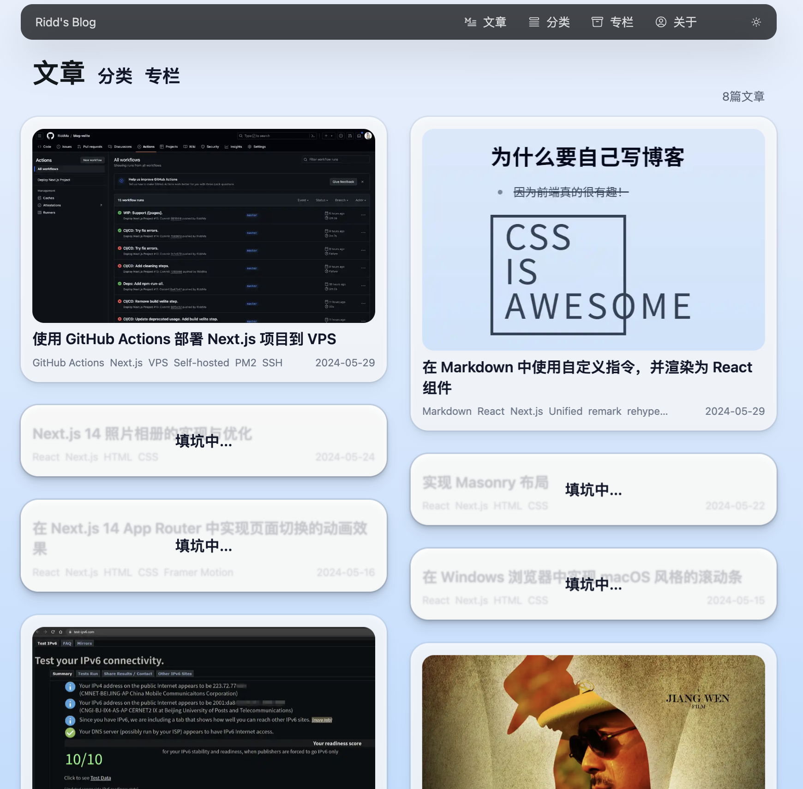

## 什么是 Masonry 布局

[这篇来自 CSS { In Real Life } 的文章](https://css-irl.info/masonry-in-css/)解释了什么是 Masonry 布局，一图胜千言：



:::gpt{model="GPT-4o"}
Masonry Layout 是一种布局方式，经常用于网页设计中，特别是展示图片、卡片或其他内容块。这种布局方式类似于砖石墙的排列（因此得名 "Masonry"），其中不同高度的内容块紧密排列，最大限度地利用了可用空间。Masonry Layout 的特点是内容块（items）之间没有固定的行和列，而是根据内容的高度动态排列，使得页面看起来更加紧凑和美观。

**Masonry Layout 的主要特点包括：**

1. **非均匀排列**：不同高度的内容块可以在同一行中出现，形成一种砖石墙般的视觉效果。
2. **动态填充**：内容块会自动填充空白区域，最大限度地利用可用空间，减少空白和间隙。
3. **响应式设计**：Masonry Layout 可以适应不同屏幕尺寸和设备，内容块会根据屏幕宽度自动调整排列方式。

**常见的实现方式：**

1. **JavaScript 库**：有很多 JavaScript 库可以帮助实现 Masonry Layout，比如 [Masonry.js](https://masonry.desandro.com/)、[Isotope](https://isotope.metafizzy.co/) 等。
2. **CSS Grid**：使用现代的 CSS Grid 布局，可以通过定义自动行高和自动列宽来实现类似的效果。
3. **CSS Flexbox**：虽然 Flexbox 不如 CSS Grid 适合 Masonry Layout，但通过一些技巧和 hack 也可以实现类似的布局。

:::


顺带一提，将 Masonry 布局发扬光大的产品，国外是 Pintrest，国内是小红书。本文的解决方案就借鉴自小红书。

在实际应用场景，Masonry 布局经常和行密铺、列密铺布局联系起来。它们都是排版图片等长宽比不一的元素的好方法。

## 行密铺和列密铺布局

下面三张图来自 [React Photo Album](https://github.com/igordanchenko/react-photo-album)，展示了在相同内容上应用行密铺、列密铺、Masonry 布局的效果。

行密铺：


↑此处可以看到，行密铺布局支持“非常宽”的元素以正常大小显示，而其余两种布局要求元素宽度大致相等，无法做到。

列密铺：


Masonry：


## 通过库实现三种布局

[这篇来自 Google Photos 的博客文章](https://medium.com/google-design/google-photos-45b714dfbed1)讲解了他们在谷歌相册应用中，如何使用 Dijkstra 算法解决图片排版问题。具体的算法实现较为复杂，好在我们能站在巨人的肩膀上。[React Photo Gallery](https://github.com/neptunian/react-photo-gallery) 是一个例子，但这个仓库上一次提交已经是 2019 年。在 issue 中，维护者推荐使用 [React Photo Album](https://github.com/igordanchenko/react-photo-album) 这个库，功能相似，支持行布局、列布局和瀑布流布局。灵感来源于 React Photo Gallery，从头开始重新设计。

此外，也有 [LightGallery](https://www.lightgalleryjs.com/) 和 [Masonry](https://masonry.desandro.com/) 这两个库可以参考。


## 手动实现 Masonry 布局

我的博客中，在文章索引页使用了 Masonry 布局。由于 Next.js 的 `<Image>` 组件需要指定图片宽度和高度参数（可以使用 `fill` 属性与 `sizes` 属性设置自动响应式布局，这部分留给读者自行实现吧），因此我们使用 JavaScript 而非 CSS 计算整体的布局。由于遗留原因，这个组件叫做 `WaterfallGrid`。它在桌面端显示 2 或 3 列 Masonry 布局，在移动端则是 1 列纵向排列的 flexbox 布局。

### 1. 创建 WaterfallGrid 组件

首先，我们定义了 `WaterfallGrid` 组件，这是实现 Masonry 布局的核心组件。该组件接收两个 props：`items`（要显示的内容数组）和 `CardComponent`（用于渲染单个内容块的组件）。

```typescript
import React, { useCallback, useEffect, useMemo, useRef, useState } from "react";
import useColumnCount from "@/src/lib/useColumnCount";
import { gsap, useGSAP } from "@/src/lib/gsap";

const cardPadding = 16;

export interface WaterfallGridProps {
  items: { slug: string; [key: string]: any }[];
  CardComponent: React.FC<{ item: { slug: string; [key: string]: any }; imgWidth: number; isMobile: boolean }>;
}

const WaterfallGrid: React.FC<WaterfallGridProps> = ({ items, CardComponent }) => {
  const containerRef = useRef<HTMLDivElement>(null);
  const itemRefs = useMemo(() => items.map(() => React.createRef<HTMLDivElement>()), [items]);
  const [layout, setLayout] = useState({
    columnHeights: [] as number[],
    positions: [] as { x: number; y: number }[],
    imgWidth: 0,
    columnWidth: 0,
  });
  const columnCount = useColumnCount(containerRef);

  // 计算列宽
  const computeColumnWidth = useCallback(() => {
    if (!containerRef.current) return;
    const width = containerRef.current.clientWidth / columnCount;
    setLayout((prev) => ({ ...prev, columnWidth: width, imgWidth: width - cardPadding * 2 }));
  }, [columnCount]);

  // 计算布局
  const computeLayout = useCallback(() => {
    const newColumnHeights = new Array(columnCount).fill(0);
    const newPositions: { x: number; y: number }[] = [];
    itemRefs.forEach((ref, index) => {
      if (!ref.current) return;
      const minHeightIndex = newColumnHeights.indexOf(Math.min(...newColumnHeights));
      newPositions[index] = {
        x: minHeightIndex * layout.columnWidth,
        y: newColumnHeights[minHeightIndex],
      };
      newColumnHeights[minHeightIndex] += ref.current.clientHeight;
    });
    setLayout((prev) => ({ ...prev, columnHeights: newColumnHeights, positions: newPositions }));
  }, [columnCount, layout.columnWidth, itemRefs]);

  // 监听 items 和 columnCount 的变化
  useEffect(() => {
    computeLayout();
  }, [items, columnCount, layout.imgWidth, computeLayout]);

  // 使用 ResizeObserver 监听容器大小变化
  useEffect(() => {
    const observer = new ResizeObserver(() => {
      computeColumnWidth();
      computeLayout();
    });
    observer.observe(containerRef.current!);
    return () => observer.disconnect();
  }, [computeColumnWidth, computeLayout]);

  // 使用 GSAP 添加动画效果
  useGSAP(() => {
    gsap.from(containerRef.current, { opacity: 0, delay: 0.25 });
  }, []);

  // 渲染移动端布局
  const renderMobile = () => {
    return (
      <div ref={containerRef} className="flex flex-col -mx-8">
        {items.map((item) => (
          <div key={item.slug} className="px-4 py-2">
            <CardComponent item={item} imgWidth={layout.imgWidth} isMobile={true} />
          </div>
        ))}
      </div>
    );
  };

  // 渲染列布局
  const renderColumns = () => {
    return (
      <div
        ref={containerRef}
        className="relative px-0 -mx-8"
        style={{ height: `${Math.max(...layout.columnHeights, 0)}px` }}
      >
        {items.map((item, index) => (
          <div
            key={item.slug}
            ref={itemRefs[index]}
            className="absolute p-4"
            style={{
              transform: `translate(${layout.positions[index]?.x}px, ${layout.positions[index]?.y}px)`,
              width: `${100 / columnCount}%`,
            }}
          >
            <CardComponent item={item} imgWidth={layout.imgWidth} isMobile={false} />
          </div>
        ))}
      </div>
    );
  };

  return <>{columnCount === 1 ? renderMobile() : renderColumns()}</>;
};

export default WaterfallGrid;
```

### 2. 解释代码

#### 1. useMemo 和 useRef

```typescript
const itemRefs = useMemo(() => items.map(() => React.createRef<HTMLDivElement>()), [items]);
```

`useMemo` 和 `useRef` 用于创建和缓存每个 item 的引用，以便在后续布局计算中使用。

#### 2. useState 初始化布局

```typescript
const [layout, setLayout] = useState({
  columnHeights: [] as number[],
  positions: [] as { x: number; y: number }[],
  imgWidth: 0,
  columnWidth: 0,
});
```

`layout` 用于存储布局信息，包括列高、位置、图片宽度和列宽。

#### 3. useCallback 计算列宽和布局

```typescript
const computeColumnWidth = useCallback(() => {
  if (!containerRef.current) return;
  const width = containerRef.current.clientWidth / columnCount;
  setLayout((prev) => ({ ...prev, columnWidth: width, imgWidth: width - cardPadding * 2 }));
}, [columnCount]);

const computeLayout = useCallback(() => {
  const newColumnHeights = new Array(columnCount).fill(0);
  const newPositions: { x: number; y: number }[] = [];
  itemRefs.forEach((ref, index) => {
    if (!ref.current) return;
    const minHeightIndex = newColumnHeights.indexOf(Math.min(...newColumnHeights));
    newPositions[index] = {
      x: minHeightIndex * layout.columnWidth,
      y: newColumnHeights[minHeightIndex],
    };
    newColumnHeights[minHeightIndex] += ref.current.clientHeight;
  });
  setLayout((prev) => ({ ...prev, columnHeights: newColumnHeights, positions: newPositions }));
}, [columnCount, layout.columnWidth, itemRefs]);
```

`computeColumnWidth` 和 `computeLayout` 是两个主要的布局计算函数，使用 `useCallback` 缓存以避免不必要的重新计算。

#### 4. useEffect 监听布局变化

```typescript
useEffect(() => {
  computeLayout();
}, [items, columnCount, layout.imgWidth, computeLayout]);
```

当 `items`、`columnCount` 或 `layout.imgWidth` 变化时，重新计算布局。

#### 5. ResizeObserver

```typescript
useEffect(() => {
  const observer = new ResizeObserver(() => {
    computeColumnWidth();
    computeLayout();
  });
  observer.observe(containerRef.current!);
  return () => observer.disconnect();
}, [computeColumnWidth, computeLayout]);
```

使用 `ResizeObserver` 监听容器大小变化，并相应地重新计算列宽和布局。

#### 6. 使用 GSAP 添加动画

```typescript
useGSAP(() => {
  gsap.from(containerRef.current, { opacity: 0, delay: 0.25 });
}, []);
```

使用 GSAP 添加加载动画，使容器元素在加载时淡入。

#### 7. 渲染布局

```typescript
const renderMobile = () => {
  return (
    <div ref={containerRef} className="flex flex-col -mx-8">
      {items.map((item) => (
        <div key={item.slug} className="px-4 py-2">
          <CardComponent item={item} imgWidth={layout.imgWidth} isMobile={true} />
        </div>
      ))}
    </div>
  );
};

const renderColumns = () => {
  return (
    <div
      ref={containerRef}
      className="relative px-0 -mx-8"
      style={{ height: `${Math.max(...layout.columnHeights, 0)}px` }}


    >
      {items.map((item, index) => (
        <div
          key={item.slug}
          ref={itemRefs[index]}
          className="absolute p-4"
          style={{
            transform: `translate(${layout.positions[index]?.x}px, ${layout.positions[index]?.y}px)`,
            width: `${100 / columnCount}%`,
          }}
        >
          <CardComponent item={item} imgWidth={layout.imgWidth} isMobile={false} />
        </div>
      ))}
    </div>
  );
};
```

根据 `columnCount` 的值，决定渲染移动端布局还是列布局。移动端布局使用 `flex` 排列，而列布局则使用 `absolute` 定位来实现 Masonry 效果。

### 3. 总结

通过以上步骤，我们实现了一个基于 React 和 TypeScript 的 Masonry 布局组件 `WaterfallGrid`。这个组件能够根据屏幕宽度动态调整内容块的排列方式，使得页面布局更加紧凑和美观。



附使用 [React Photo Album](https://github.com/igordanchenko/react-photo-album) 和 Next.js Image 实现的列密铺布局：


## 参考阅读

[Tobias Ahlin 的文章](https://tobiasahlin.com/blog/masonry-with-css/)：介绍了如何使用 Flexbox、`:nth-child()` 和 `order` 属性创建 CSS Masonry 布局。通过将 `flex-flow` 设置为 `column wrap` 并使用 `:nth-child()` 和 `order` 重新排列元素，可以实现从左到右的顺序渲染。文章详细解释了实现步骤，包括强制换列的伪元素使用。最终效果是无需 JavaScript 即可实现 Masonry 布局，但需要手动设置容器高度和列间距。

[FlexMasonry（最后提交：2019 年）](https://github.com/gilbitron/flexmasonry) 是一个轻量级、零依赖的瀑布流布局库，使用 CSS flexbox 实现。它受 Tobias Ahlin 使用 `flex`、`:nth-child()` 和 `order` 创建纯 CSS 瀑布流布局的启发，并加入了一些 JavaScript，使其易于使用。特点包括轻量（6KB JS 和 CSS）、快速（使用 CSS flexbox 布局）、响应式设计（在不同断点显示不同列数）和简单设置（仅需 3 个选项）。

博客文章：[使用纯 CSS 实现 Google Photos 照片列表布局](https://github.com/xieranmaya/blog/issues/4)，用了很多 trick，最后得到的结果有一些小 bug。胜在不依赖 JavaScript，利好 SSG 静态网页，并且纯 CSS 有 GPU 加速，性能更强。
